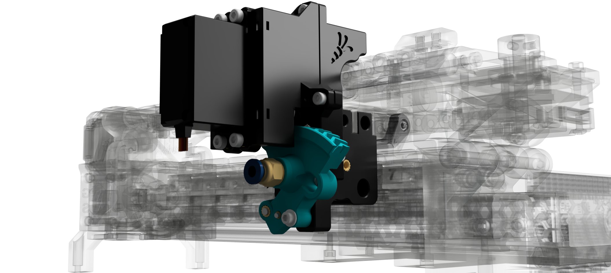
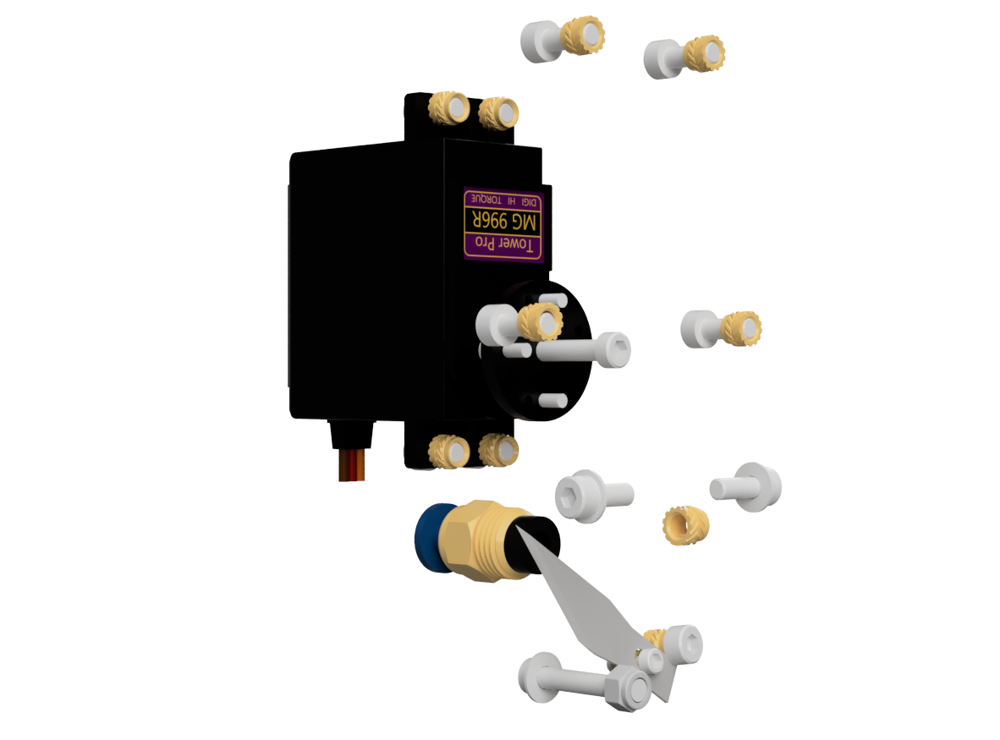
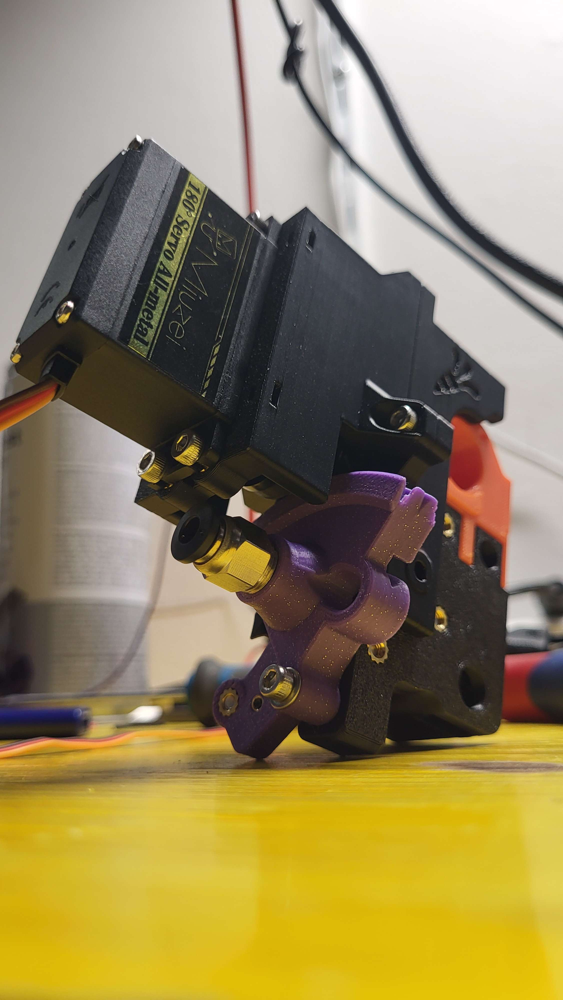

   

# Enraged Rabbit Encoder Cutter - Beta 7.0 🥕

   &nbsp; 
   &nbsp;
   &nbsp;

### Attention! 
<strong> I’m not an expert and 3D printing is just my hobby. So please be careful when you build this mod and don’t just go ahead. All parts are tested and working. But everybody bears the risks of a modification him/herself! I'm not responsible if any harm occurs, so be careful, especially with the knife! </strong>

## Overview 

**[EREC](#erec)** 
**[BOM](#bom)** 
**[Assembly](#assembly)** 
**[Firmware](#firmware)** 
**[Changelog](#changelog--archive)** 
**[Showroom](#Showroom)** 
**[Acknowledgements](#Acknowledgements)** 

## EREC

This is a simple filament cutter for the awesome ERCF so tip tuning is less important.

It's made out of a Servo and a scalpell/exacto knife blade. The cutter get's mouted to the selector chart just behind the encoder - the cutter is basically an arm that swings to the left and right. Since the ECAS sits now on the Arm the filament path can be opened by swining the arm to the side. Then the ERCF can feed some filament mid air (*the filament tip*) and when the arm swings back to close the filament path the tip gets cut off by the knife on the arm. The cut off tip just falls off to the ground and the filament can be loaded with a clean tip the next time.

#### Why?
I never thought about a filament cutter untill I saw the [Filametrix](https://github.com/sorted01/Filametrix) design / got it recommended. Since I'm not using the ERCF with a Stealthburner (for now at least) I would have to make a cutter on my own. At the same time u/[BioKeks](https://github.com/BioCookieYT) requested a cutter for my Ender 3 fan duct ([Frankenstein 2.0](https://github.com/kevinakasam/FrankEnstein-Duct/tree/main/Frank2.0_Beta)) and that way I though we need something universial. After some days of tinkering this was the result - first with the MG90s servo, but that was so weak it was far aways from cutting it. So long speech short, thanks to [sorted01](https://github.com/sorted01) for the idea with the cutter!

#### Current Status
Considering my other ongoing [projects](https://kevinakasam.com/), I’ve decided to appoint u/[BioKeks](https://github.com/BioCookieYT) as the new primary contributor to this project. Don’t worry, I’m not completely stepping away, but if you have any questions, feel free to ask u/[BioKeks](https://github.com/BioCookieYT)!
 
 

## BOM
<table>
<tr>
<td width=25%></td>
<td>
You can find the EREC BOM here. Make sure to gather all the required hardware before starting the assembly process ;)

[BOM](Doc/BOM.md) 
</td>
</tr>
</table>
 

## Assembly 

<table>
<tr>
<td>
The assembly process is straightforward; I’ve tried my best to keep it simple. If you need any help, feel free to join our discord server. 

[Documentation](Doc/EREC_BETA7.pdf) &nbsp;&nbsp; [Discord Server](https://discord.gg/Jw4frr64yV) &nbsp;&nbsp; [Discord Channel Link](https://discord.com/channels/964441223169449984/1169733100700434543)
<td width=35%></td>
</td>

</tr>
</table>

 

## Firmware
<table>
<tr>
<td width=20%></td>
<td>
EREC uses HappyHareV2 as its firmware. Thanks to maggieuk, you can enjoy easy integration as a third-party addon. For people using still ERCF-Software-V3, you can try the fork from u/ntchris. 

 [Happy Hare](https://github.com/moggieuk/Happy-Hare/wiki/Addon-Feature-Setup#---erec-filament-cutter) &nbsp;&nbsp; [ERCF-Software-V3 Fork](https://github.com/ntchris/ERCF-Software-V3)
</td>
</tr>
</table>

 

## Changelog & Archive
<table>
<tr>
<td>
EREC has undergone a long development process. Feel free to visit older revisions if you wish to explore its history 🥕

[Changelog](Doc/Changelog.md) &nbsp;&nbsp; [Archive](https://github.com/kevinakasam/ERCF_Filament_Cutter/tree/main/Archive) 
<td width=25%></td>
</td>

</tr>
</table>

 

## Showroom
 

 #### Cutter Action (old version 😉):

## Acknowledgements
Thanks to...

-	[KevinAkaSam](https://kevinakasam.com/) – The magic guy who developed the first concept of EREC!
-	[BioKeks](https://github.com/BioCookieYT) – Developer of EREC Beta6 and Beta7
-	[xF4m3](https://github.com/xF4m3) – Thanks for helping with the Macros and tinkering with us
-	[sorted01](https://github.com/sorted01) – The guy behind Filametrix, thanks for the idea with the cutter!
-	[moggieuk](https://github.com/moggieuk) – Thanks a lot for awesome firmware and the quick help on the Voron Discord!
-	[HooiiooH](https://github.com/HooiiooH) and  [WiggyWooSaa](https://www.printables.com/de/@WiggyWooSaa_207419) – Thanks for the amazing mod ideas for Beta7 <3
-	[jmillerfo](https://www.printables.com/de/@jmillerfo_84104) – Unofficial developer of EREC Beta6.5 ;p, thanks a lot for some design ideas!
-	[jckennell](https://www.printables.com/de/@jckennell_470501) – Maker of the original Tip collector ;)
-	[ntchris](https://github.com/ntchris) – Thanks for making EREC compatible with ERCF-Software-V3
-	[comnmnor](https://github.com/nnaapp) - Thanks a lot for making EREC compatible with [Night Owl](https://github.com/kevinakasam/ERCF_Filament_Cutter/tree/main/Usermods/EREC%20For%20Nightowl)

And of course thanks to [EtteGit](https://github.com/EtteGit) and the amazing ERCFV2 Team for the awesome [EnragedRabbitProject](https://github.com/EtteGit/EnragedRabbitProject)!
