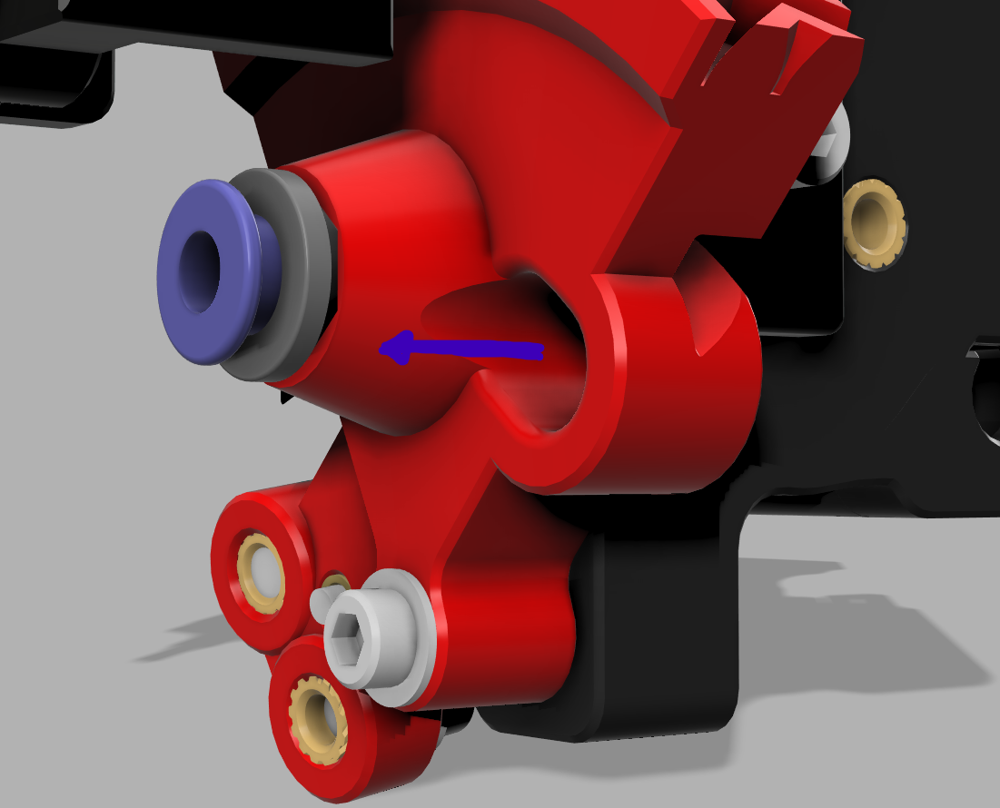
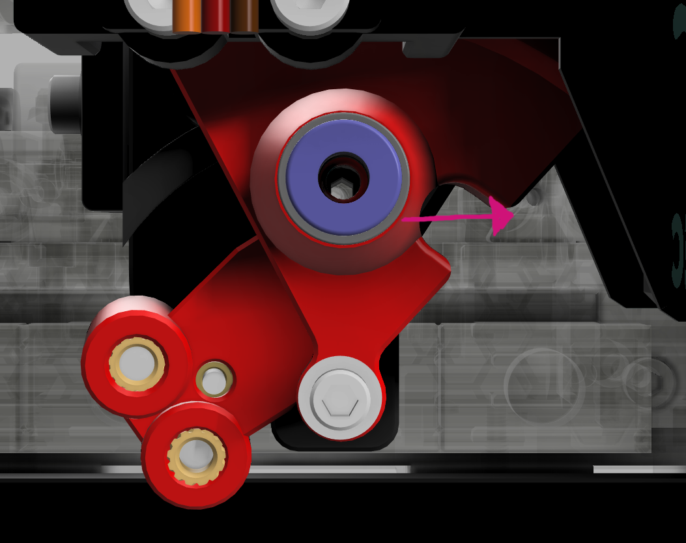

# EREC - Print Settings 🥕
Ensure your printer is well-tuned. Basic settings like EM, PA, and shrinkage should be calibrated. See more in this [guide](https://ellis3dp.com/Print-Tuning-Guide/).

- Material: ABS/ASA 
- 5 walls
- 55% cubic infill
- 5 top/bottom layers
- 0.20mm layer height except:

### `0.16mm [a] Cutter_Arm_XXX.stl`
- **Layer height: 0.16mm!!!**  
  The built-in supports won't work properly if printed with a 0.20mm layer height.

# `Cutter_Arm` Closed vs Open
There are two versions of the cutter arm: closed and open. From my testing, the main difference is how the tip behaves after it gets cut. With the open version, the tip flies to the right, while with the closed version, the tip flies toward the front.
   

There is no better or worse version; it depends on your mounting solution which version you need. If you plan to use the tip collector, use the open version.